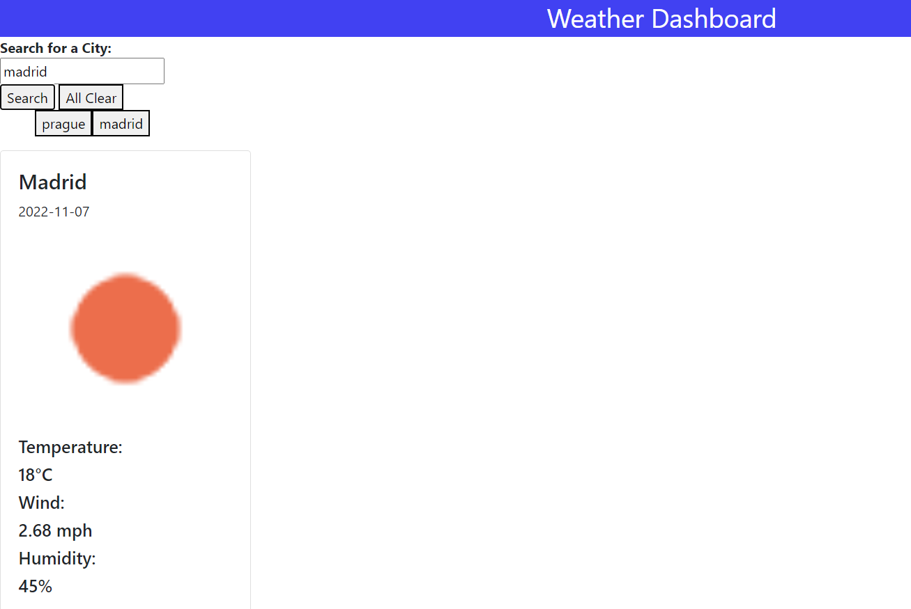

# Timothy-Assignment6---Weather Dashboard

## Description
This is a project for 5 days weather forecast. Input the city name in the search bar and you would be able to get the 5 days weather forecast in the world. 

## User Guide
1. Input the city name in the search bar
2. The 5 days weather forecast will be automatically displayed
3. The city's name input will be stored below the search bar. You can click the city's name to get the weather forecast without entering the name agagin
4. The clear button is for clearing all the information and search history

## Screenshot

## Website Link
https://timo9939.github.io/assignment6/

## Repository Link
https://github.com/timo9939/assignment6